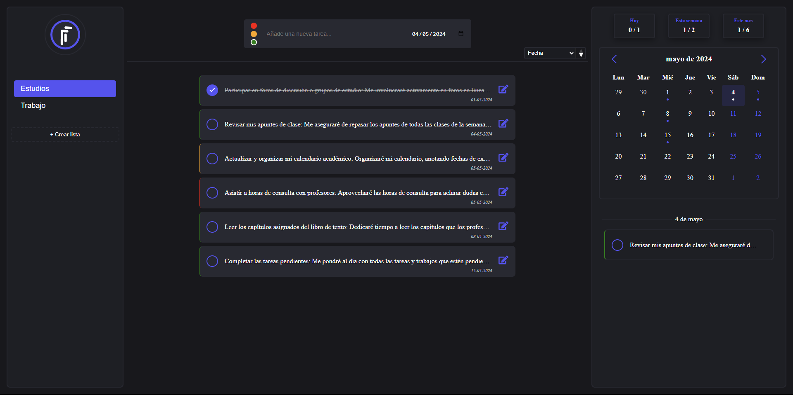

# TaskIt [](https://opensource.org/license/mit)

TaskIt es una aplicación de gestión de tareas extremadamente simple, diseñada para ofrecer simplicidad y eficiencia en la organización de actividades mensuales de manera más estructurada. Esta aplicación, construida con Angular, presenta una interfaz de usuario minimalista y fácil de usar.

Con TaskIt, los usuarios pueden crear nuevas tareas rápidamente mediante un formulario sencillo. También es posible editar detalles de tareas existentes, tales como fechas de vencimiento, prioridades y descripciones. Del mismo modo, se pueden eliminar las tareas que ya han sido completadas.

## Stack


# Diseño



## Ejecución en local

Clonar el proyecto

```bash
  git clone https://github.com/devmetori/TaskIt.git
```

Ir al directorio del proyecto

```bash
  cd TaskIt
```

Instalar dependencias

```bash
  pnpm install
```

Iniciar la aplicación

```bash
  pnpm run dev
```

## Colaboración

Siéntete libre de añadir nuevas funcionalidades o de corregir las existentes; por cualquier cosa, no dudes en contactarme.

[](https://www.linkedin.com/in/mtort/)
